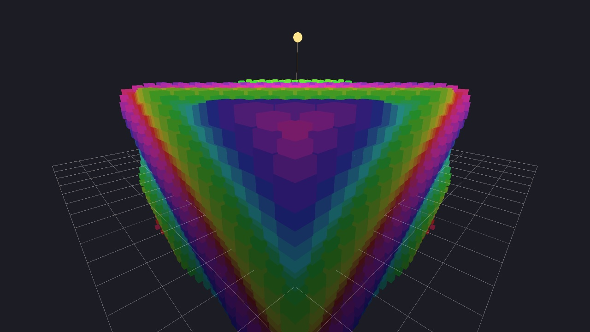

# rayrender

A raylib 6.0 showcase aimed at the **software renderer** (`rlsw`), built with [rlsw-cc](https://github.com/sreekotay/rlsw-cc) — an optimized rlsw fork in [Concurrent-C](https://github.com/sreekotay/concurrent-c) (strict C11-superset preprocessor: `.ccs` lowers to plain C and compiles with your host C compiler).



Three scenes, native 1280×720 by default, enough triangles and fill to make CPU rasterization interesting.

| Key | Scene |
| --- | --- |
| `1` | First-person cubicmap maze |
| `2` | Heightmap + knot viewer (drag-and-drop models) |
| `3` | Waving-cube storm around a high-poly knot |

## Build

Needs CMake, a C compiler, and git. Configure **FetchContents** [raylib](https://github.com/raysan5/raylib) 6.0 and [rlsw-cc](https://github.com/sreekotay/rlsw-cc) (or uses a local `./rlsw-cc` tree if present). **No `ccc` required** to build — rlsw-cc vendors a Concurrent-C portable runtime.

The software build uses raylib's **RGFW** platform, not GLFW. GLFW's swap path never copies the CPU framebuffer, so the window stays black.

```bash
cmake -S . -B build
cmake --build build -j
./build/rayrender            # rlsw-cc overlay
./build/rayrender-stock      # stock rlsw 1.5 referee
./tools/rayrender.sh cc      # or stock
./tools/parity.sh --smoke
```

Optional: pin rlsw-cc without a local tree:

```bash
cmake -S . -B build -DRAYRENDER_RLSW_CC_LOCAL=OFF \
  -DRAYRENDER_RLSW_CC_GIT=https://github.com/sreekotay/rlsw-cc.git
```

Software CMake builds **both** binaries. `rlsw_cc_overlay_raylib` overlays `rlsw.h` and (by default) applies **soft present** — the RGFW swap / macOS CGImage staging path now ships inside [rlsw-cc](https://github.com/sreekotay/rlsw-cc) (`RLSW_CC_SOFT_PRESENT`).

GPU comparison build:

```bash
cmake -S . -B build-gpu -DRAYRENDER_GPU=ON
cmake --build build-gpu -j
./build-gpu/rayrender
```

Release is the default. SIMD in `rlsw` is on unless you pass `-DRAYRENDER_SIMD=OFF`.

## Performance

Apple Silicon (this machine), maze, quality 2, adaptive on, **hstripe** parallel fill. Means of 3×60-frame runs via `./tools/parity.sh` (12-frame runs are too noisy). Window size → Retina draw FB in parentheses.

| Mode | Window (draw FB) | Filter | stock ms | cc ms | vs stock |
| --- | --- | --- | ---: | ---: | ---: |
| bench | 1280×720 (2560×1440) | point | 1138 | 330 | **3.45×** |
| bench | 1280×720 (2560×1440) | bilinear | 1754 | 379 | **4.63×** |
| retina | 2560×1440 (5120×2880) | point | 4128 | 949 | **4.35×** |
| retina | 2560×1440 (5120×2880) | bilinear | 6587 | 1195 | **5.51×** |

```bash
RAYRENDER_FRAMES=60 ./tools/parity.sh --bench
RAYRENDER_FRAMES=60 RAYRENDER_FILTER=bilinear ./tools/parity.sh --bench
RAYRENDER_FRAMES=60 ./tools/parity.sh --retina
RAYRENDER_FRAMES=60 RAYRENDER_FILTER=bilinear ./tools/parity.sh --retina
```

Checksums DIFF vs stock after bary-plane work; cc bench point stays `0x2e13ab57d738130a`. More detail: [rlsw-cc performance](https://github.com/sreekotay/rlsw-cc#performance-vs-stock-rlsw-15).

## Controls

| Key | Action |
| --- | --- |
| `1` `2` `3` / `Tab` | Switch scene |
| `-` `=` | Render scale (0.25–1.00). Default is 1.00, drawn straight to the window |
| `[` `]` | Quality 0–2 (rebuilds meshes). Default is 2 |
| `F` | Point / bilinear filter |
| `L` | Wireframe |
| `C` | Face culling |
| `I` | Vertex lighting (sun + maze flashlight) |
| `O` | Orbit the sun |
| `A` | Adaptive `1/w` blocks (`rayrender` / cc only) |
| `B` | Cycle bin mode (hstripe / vstripe / tiles / off) |
| `H` | HUD |
| `Q` | Quit |

Maze uses first-person WASD + mouse. Viewer orbits. Stress auto-orbits.

Default quality 2 is roughly a 65×65 maze, a 176² heightmap plus a dense knot, and a 16³ cube grid. That is meant to push fill rate and polycount, not to look like a 320×180 demo.
